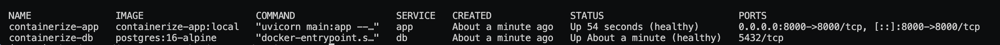
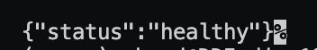
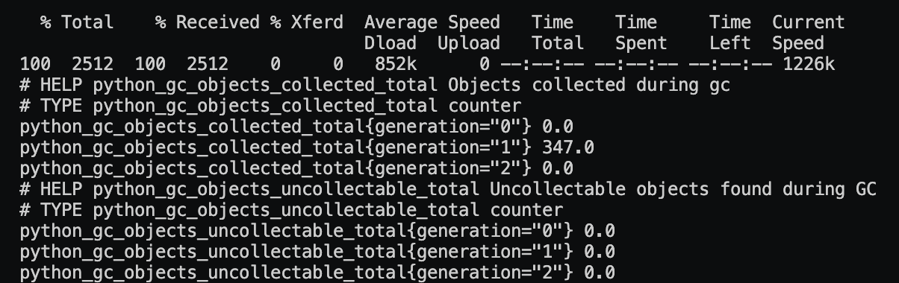
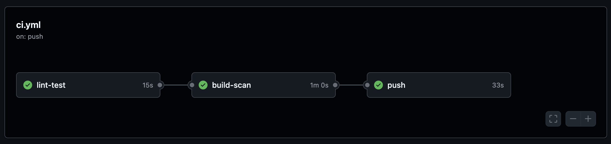
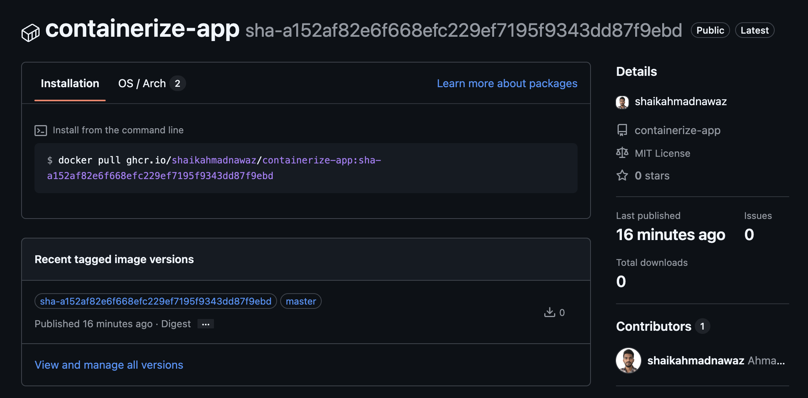

# containerize-app

A FastAPI application containerized with Docker and PostgreSQL, with CI checks, image scanning, and operational documentation.

## Overview

This project is a small API service packaged for local development and CI validation.

It includes:

- a multi-stage Docker build
- a local Docker Compose stack
- health, readiness, info, and metrics endpoints
- smoke tests
- GitHub Actions CI
- Trivy image scanning
- supporting operational documentation

## Architecture

The project runs a FastAPI application and PostgreSQL using Docker Compose.

- `app` runs the API container
- `db` runs PostgreSQL on an internal Docker network
- only the API is exposed on port `8000`
- health, readiness, and metrics endpoints support validation and monitoring
- GitHub Actions builds, scans, and pushes the image to GHCR

For more details, see [docs/architecture.md](docs/architecture.md).

## Project Structure

```text
containerize-app/
├── app/                  # FastAPI application
├── docs/                 # Architecture, operations, runbook, security, testing
├── scripts/              # Setup and cleanup helpers
├── tests/smoke/          # Smoke tests
├── .github/workflows/    # CI pipeline
├── Dockerfile
├── docker-compose.yml
├── Makefile
├── pytest.ini
├── LICENSE
└── README.md
```

## Prerequisites

- Docker
- Docker Compose plugin
- Python 3.14+ if you want to run tests outside the container
- Trivy if you want to run the vulnerability scan locally

## Run the Project

Start the local stack:

```bash
docker compose up -d
```

Check running containers:

```bash
docker compose ps
```

Stop the stack:

```bash
docker compose down
```

## Validate the Application

Run these commands after the stack is up:

```bash
curl http://localhost:8000/health
curl http://localhost:8000/ready
curl http://localhost:8000/info
curl http://localhost:8000/metrics | head
```

## Run Output

Local stack startup:

```bash
docker compose up -d
```

Running containers:

```bash
docker compose ps
```



Health, readiness, and runtime info:

```bash
curl http://localhost:8000/health
curl http://localhost:8000/ready
curl http://localhost:8000/info
```



Metrics output:

```bash
curl http://localhost:8000/metrics | head
```



## Run Checks

Smoke tests:

```bash
python3 -m pip install -r app/requirements.txt pytest httpx
python3 -m pytest tests/smoke -v
```

Build the image:

```bash
docker build --target runtime -t containerize-app:local .
```

Run the image scan:

```bash
trivy image --exit-code 1 --severity HIGH,CRITICAL containerize-app:local
```

## Useful Commands

```bash
docker compose up -d
docker compose ps
docker compose logs -f app
docker compose down
docker compose down -v
docker build --target runtime -t containerize-app:local .
python3 -m pytest tests/smoke -v
trivy image --exit-code 1 --severity HIGH,CRITICAL containerize-app:local
```

## Application Endpoints

| Endpoint | Purpose |
| --- | --- |
| `/` | Basic app info |
| `/health` | Liveness check |
| `/ready` | Readiness check with database connectivity |
| `/info` | Runtime information |
| `/metrics` | Prometheus metrics |

## CI/CD

The GitHub Actions workflow does the following:

1. run lint and smoke tests
2. build the runtime image
3. scan the image with Trivy
4. push the image to GHCR from `master`

Workflow file:
[.github/workflows/ci.yml](.github/workflows/ci.yml)

CI pipeline result:



Published package:



## Documentation

- [docs/architecture.md](docs/architecture.md)
- [docs/operations.md](docs/operations.md)
- [docs/runbook.md](docs/runbook.md)
- [docs/security.md](docs/security.md)
- [docs/testing.md](docs/testing.md)
- [docs/scaling.md](docs/scaling.md)
- [docs/cost.md](docs/cost.md)
- [docs/decisions.md](docs/decisions.md)

## Notes

- The local stack uses PostgreSQL on an internal Docker network.
- The application container runs as a non-root user.
- The Compose setup uses a read-only filesystem for the app container.
- The readiness endpoint checks database connectivity, not just environment variables.
- A `Makefile` is included as an optional shortcut, but the commands above are the primary documented workflow.
